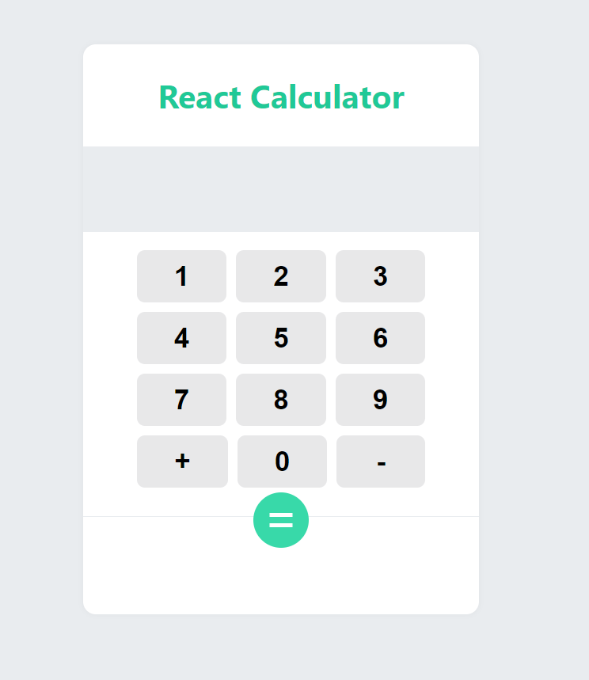
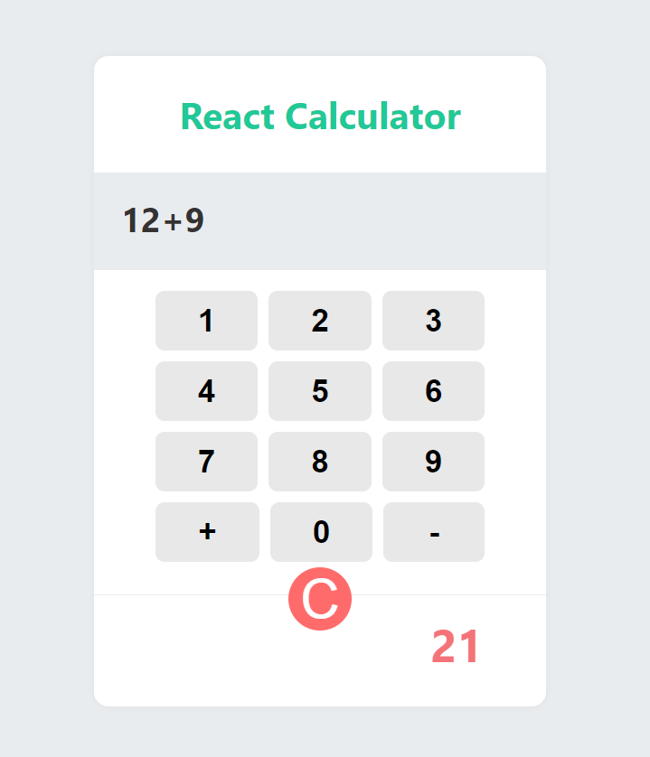
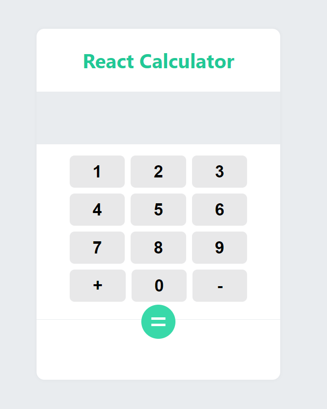

# React로 간단한 계산기 구현
- class형 컴포넌트 vs **function형 컴포넌트**
- props,state(Hook의 useState) 공부
- styled-components의  { css }라이브러리를 통해 props에 따라 css 바뀌게 할 수 있다.. (css안에서 로직을 넣을 수 있음)

# 계산전

# 계산후
- = 버튼이 c(클리어)로 바뀐다.   

# C버튼 클릭 후
- 초기화가 된다.    

